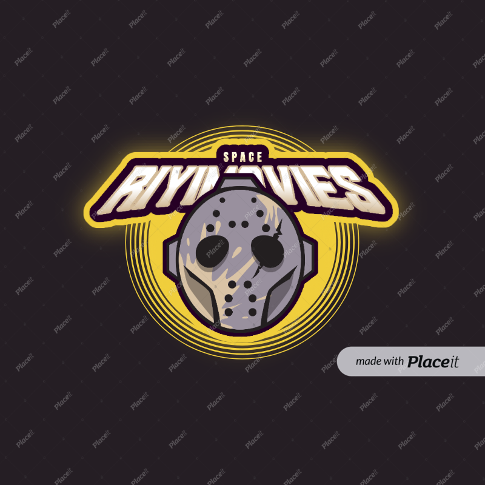

# 📗 Table of Contents

- [📗 Table of Contents](#-table-of-contents)
- [📖 \[RIYIMOVIE CHANNEL\] ](#-riyimovie-channel-)
  - [🛠 Built With ](#-built-with-)
    - [Tech Stack ](#tech-stack-)
    - [Key Features ](#key-features-)
  - [💻 Getting Started ](#-getting-started-)
    - [Prerequisites](#prerequisites)
    - [Setup](#setup)
    - [Install](#install)
    - [Usage](#usage)
    - [Run tests](#run-tests)
    - [Deployment](#deployment)
  - [👥 Authors ](#-authors-)
  - [🔭 Future Features ](#-future-features-)
  - [🤝 Contributing ](#-contributing-)
  - [⭐️ Show your support ](#️-show-your-support-)
  - [🙏 Acknowledgments ](#-acknowledgments-)
  - [📝 License ](#-license-)

# 📖 [RIYIMOVIE CHANNEL] 

This is the web application app that will help other developer get motivated on creating the API apps and movie sites.
Its Mobile vision app and can be accessed on the Mobile devices and Desktop

**[Mobile portfolio app]** is a Mobile vision app that makes easier for Developers to chocase there projects
so that other developer's can find them or see what the have built.

## 🛠 Built With 

    - [HTML](#HTML)
    - [CSS](#CSS)
    - [Javascript](#Javascript)
    - [Webpack](#Webpack)
    - [ES6](#ES6)
    - [API](#API)
### Tech Stack 

  
Client

  <ul>
    <li><a href="https://js.org/">JAVASCRIPT</a></li>
  </ul>

  
Client

  <ul>
    <li><a href="https://css.org/">CSS</a></li>
  </ul>

  
Server

  <ul>
    <li><a href="https://html.com/">HTML</a></li>
  </ul>

### Key Features 

- **[The project was built using ES6]**
- **[Modules were imported/exported for the JavaScript]**
- **[Webpack bundling was used]**
- **[TVMaze and Invovlement APIs were consumed]**
- **[GitHub Projects was used to track progress throughout the app building]**

(<a href="#readme-top">back to top</a>)

- [Presentation Link](coming soon)

<!-- ## 🚀 Live Demo  -->

(<a href="#readme-top">back to top</a>)

## 💻 Getting Started 

To all the new developers this project will give you an idea how to start building your mobile vision apps
To get a local copy up and running, follow these steps.
follow me on my github account at richie1988 then clone or fork the repository called mobile-portfoliofinish

### Prerequisites

In order to run this project you need:
desktop-computer/laptop
any text editor installed inside

### Setup

Clone this repository to your desired folder:
run:
git clone (https://github.com/richie1988/KanbanCapstone)

### Install

Install this project with:

github
git
cmd

### Usage

To run the project, execute the following command:

npx git install
git clone
### Run tests

To run tests, run the following command:
npx stylelint "\*_/_.{css,scss}"

### Deployment

You can deploy this project using:
.Vscode
.github
.git
.any text editor

(<a href="#readme-top">back to top</a>)

### Deployment

You can deploy this project using:

-[Deployment Link](https://richie1988.github.io/KanbanCapstone/dist)

## 👥 Authors 

I would like Thank Microverse Team and my Collabaration partners whom they have paired me for the entire project the contributed there knowledge and ideas towards the Contact form part for this projects.

👤 **Author**
 **Richard Sikaonga**
- GitHub: [@githubhandle](https://github.com/richie1988)
- Twitter: [@twitterhandle](@Richiesikaonga)
- LinkedIn: [LinkedIn](in/richard-sikaonga-039940275)

👤 **Author2**
 **Ismail Halliru Muhammad**
- GitHub: [@githubhandle](https://github.com/ismailhallirumuhammad)
- Twitter: [@twitterhandle](https://mobile.twitter.com/IsmailhalliruM1)
- LinkedIn: [LinkedIn](https://www.linkedin.com/mwlite/in/ismail-halliru-muhammad-2a8453127)

(<a href="#readme-top">back to top</a>)

## 🔭 Future Features 

- **[Consumption of more APIs]**
- **[More dynamic styling]**
- **[Improved UX interaction]**

(<a href="#readme-top">back to top</a>)

## 🤝 Contributing 

Contributions, issues, and feature requests are welcome!

Feel free to check the [issues page](https://docs.github.com/en/issues).

(<a href="#readme-top">back to top</a>)

## ⭐️ Show your support 

Give a like if you like this project and kindly follow us using our social media handles
<!-- 
If you like this project please feel free to reach me on social media platform and contact me ready to face new world challenges and takle them kindly show your support by reaching me and giving me the opportunity i need. -->

(<a href="#readme-top">back to top</a>)

## 🙏 Acknowledgments 

I would like to thank the Microverse Team and the founder of Microverse for the opportunity is giving the young and old developer to merg through the world of opportunity.

(<a href="#readme-top">back to top</a>)

## 📝 License 

This project is [MIT](./MIT.md) licensed.

(<a href="#readme-top">back to top</a>)

